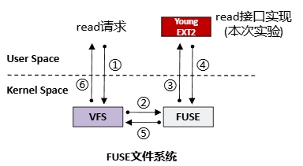

基于FUSE架构实现了一个EXT2的文件系统。

## FUSE架构

VFS是Linux虚拟文件系统，是所有内核文件系统的统一接口。

来自用户态的文件请求到达内核文件系统，就会调用对应的接口，在FUSE架构中，内核态并不负责实现对应的接口，它会额外注册到FUSE的用户态部分，也就是图中红色的部分。本次实验的任务就是在红色部分中实现内核态的各种文件接口。

 

## EXT2文件系统的磁盘布局

磁盘由以下五部分组成：超级块、索引节点位图、数据块位图、索引节点区和数据块区。需要设计各部分在磁盘中所占空间的大小。

 

虚拟磁盘的大小为4MB，每个逻辑块的大小为1024B。超级块只需要一个逻辑块即可容纳。即使每个文件只占一个逻辑块，磁盘中最多可存储的文件数量也只有4096，不超过一个逻辑块的大小，因此索引节点位图和数据块位图各自只占用一个逻辑块。

一个逻辑块中存放16个索引节点（为什么是16个在下一个部分中说明），一个文件最多占用4个逻辑块，最少占用一个逻辑块，也就是说最多磁盘中可以存放4096-1-1-1 = 4093个文件（忽略索引节点区），而这么多的文件需要4093/16≈256个逻辑块存放索引节点，也就是说数据块的数量为4093-256 = 3837（这只是粗略的估计，但与准确计算的结果相差不大）。

最终，磁盘布局的设计如下

